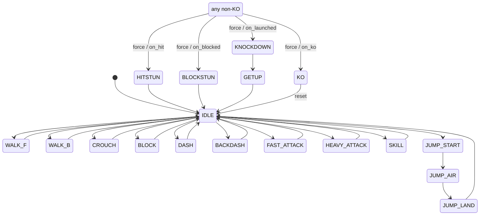

# Character FSM

The hand-rolled state machine every character shares (`game.md` task 1.3).
Implementation: `scripts/fsm/character_state_machine.gd`. Design rationale:
`docs/superpowers/specs/2026-06-27-fsm-architecture-design.md`.

## What it is (and isn't)

`CharacterStateMachine` is a dependency-free `RefCounted`: it knows *what state a
character is in* and *which transitions are structurally legal*. It owns **no**
physics, input, or frame data. The character controller (1.4) composes one and
decides *what to do* in each state.

It enforces **structural** legality only (e.g. you must land before you can walk).
It does **not** encode timing or cancels — move durations and cancel windows are
frame data (Phase 2) and the cancel system (3.5), applied by the controller.

## States (20)

| State | Category | Meaning |
|---|---|---|
| `IDLE` | actionable | neutral standing |
| `WALK_F` / `WALK_B` | actionable | walking toward / away |
| `CROUCH` | actionable | crouching |
| `JUMP_START` | busy | prejump squat (grounded) |
| `JUMP_AIR` | airborne | neutral jump, airborne |
| `JUMP_F` / `JUMP_B` | airborne | forward / back jump, airborne |
| `JUMP_LAND` | busy | landing recovery (grounded) |
| `DASH` / `BACKDASH` | busy | forward dash / backdash |
| `BLOCK` | actionable | guard stance |
| `FAST_ATTACK` | busy / attacking | light attack |
| `HEAVY_ATTACK` | busy / attacking | heavy attack |
| `SKILL` | busy / attacking | special/skill |
| `HITSTUN` | reaction | freeze after being hit |
| `BLOCKSTUN` | reaction | freeze after guarding a hit |
| `KNOCKDOWN` | reaction | knocked to the floor |
| `GETUP` | busy | waking up (often with invuln, added later) |
| `KO` | terminal | rounds-ending defeat |

Jump phases: `JUMP_START` (squat) -> exactly one airborne state
`JUMP_AIR`/`JUMP_F`/`JUMP_B` (by held direction) -> `JUMP_LAND` -> `IDLE`. In 1.3,
attacks and `HITSTUN` are treated as **grounded**; air-attack/air-hit variants
arrive with Phase 2/3.

## Transition rules

`request(next)` is gated by `can_transition`, defined as explicit per-category
exits:

| From | May `request` -> |
|---|---|
| `KO` | nothing (only `reset()`) |
| actionable (IDLE/WALK_F/WALK_B/CROUCH/BLOCK) | IDLE, WALK_F, WALK_B, CROUCH, BLOCK, JUMP_START, DASH, BACKDASH, FAST_ATTACK, HEAVY_ATTACK, SKILL |
| airborne (JUMP_AIR/F/B) | JUMP_LAND |
| JUMP_START | JUMP_AIR, JUMP_F, JUMP_B |
| JUMP_LAND / DASH / BACKDASH / GETUP | IDLE |
| FAST_ATTACK / HEAVY_ATTACK / SKILL | IDLE |
| HITSTUN / BLOCKSTUN | IDLE |
| KNOCKDOWN | GETUP |

- **Grounded <-> air** crossing is only via `JUMP_START` (up) and `JUMP_LAND` (down).
- **Busy states allow only their resolved exit** — a new action is rejected;
  cancels (3.5) open specific attack exits later by the controller checking frame
  windows, not by widening this table.
- **Reactions and KO are entered by `force()`**, legal from any non-KO state:
  `on_hit()`->HITSTUN, `on_blocked()`->BLOCKSTUN, `on_launched()`->KNOCKDOWN,
  `on_ko()`->KO. Re-forcing a reaction re-applies it (a fresh hit resets stun).
- Re-`request`ing the current state is a no-op that returns `true` (so a polling
  controller can request a held direction every frame without resetting timers).



## How a controller uses it (1.4 onward)

```gdscript
var _fsm := CharacterStateMachine.new()

func _physics_process(_delta: float) -> void:
    # 1. read state + frame_in_state, drive movement/animation/hitboxes
    match _fsm.state:
        CharacterStateMachine.State.WALK_F:
            velocity.x = walk_speed
        # ...
    # 2. translate buffered input into transition requests
    if want_jump and CharacterStateMachine.is_actionable(_fsm.state):
        _fsm.request(CharacterStateMachine.State.JUMP_START)
    # 3. resolve busy states when their frame window (frame data) elapses
    # 4. advance the clock — once, at the end
    _fsm.tick()
```

Combat (Phase 2) calls `on_hit()/on_blocked()/on_launched()/on_ko()` on the
victim's machine during hit resolution.

## Frame counter

`frame_in_state` is `0` on the entry frame and increments by one per `tick()`.
A transition resets it to `0` and absorbs the first following `tick()`, so a state
entered mid-frame still reads `0` for its first full frame and begins counting
`1, 2, …` afterward. **Call `tick()` exactly once per physics frame, at the end of
the update.** Read `frame_in_state` (e.g. "prejump is 4 frames") *before* ticking.

## Extending it (e.g. Jacob the grappler, 6.4)

Add the new members to `State`, slot each into the right category predicate
(`is_busy`, `is_in_reaction`, …), and add its row to `can_transition`. For grabs:
`GRAB_ATTEMPT` (busy, from actionable), `GRABBED` (reaction-like, forced on the
victim), `THROW_RELEASE` (busy -> IDLE). No structural change to the machine.

## Verifying

- **Unit tests (headless):** `<godot> --headless --script res://tests/test_fsm.gd`
  — 55 checks, exit 0 on success.
- **Live demo:** run `scenes/dev/fsm_demo.tscn` (it auto-drives the FSM through
  every state and prints each transition). This is a throwaway 1.3 dev aid,
  replaced by the real debug overlay (1.1) + input (1.2) during 1.4 integration.
