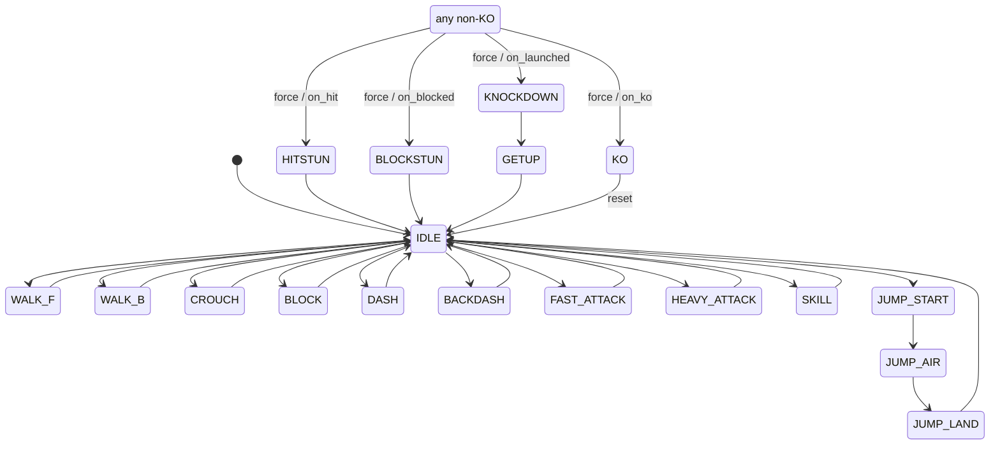

# Character FSM Architecture (1.3) Implementation Plan

> **For agentic workers:** REQUIRED SUB-SKILL: Use superpowers:subagent-driven-development (recommended) or superpowers:executing-plans to implement this plan task-by-task. Steps use checkbox (`- [ ]`) syntax for tracking.

**Goal:** Build the hand-rolled `CharacterStateMachine` (the 20-state FSM every character uses), prove it with headless tests and a throwaway live demo run through the Godot MCP, and document it in `docs/fsm.md`.

**Architecture:** A dependency-free `RefCounted` FSM holding `state` + `frame_in_state` with category-based, structural-only transition rules. The character controller (1.4) will own one, poll it each `_physics_process`, and call `tick()` once per frame. A cosmetic `state_changed` signal feeds reflectors (debug text now, VFX/SFX later).

**Tech Stack:** Godot 4.7, GDScript (static typing), Godot MCP for run/verify.

## Global Constraints

- **Engine:** Godot 4.7; GDScript per `docs/conventions.md` style (tabs, static typing everywhere cheap, one `class_name` per file).
- **Determinism:** integer frames at 60 Hz, never `delta`; gameplay logic in `_physics_process`.
- **Signals vs calls:** anything affecting the match is polled/called directly; `state_changed` is a cosmetic reflector only.
- **No over-engineering:** enum-based machine, no generic FSM framework / ECS / per-state classes. Structural legality only — no timing/cancel rules (those are Phase 2 / 3.5).
- **Branch:** `feat/1.3-fsm-architecture`. Commits: Conventional Commits, `type(scope): desc [1.3]`, ending with `Co-Authored-By: Claude Opus 4.8 <noreply@anthropic.com>`.
- **Spec of record:** `docs/superpowers/specs/2026-06-27-fsm-architecture-design.md`.

---

## Task 0: Locate the Godot 4.7 binary (one-time setup)

**Files:** none (environment discovery).

- [ ] **Step 1: Find a Godot binary for headless test runs**

Run (first match wins):
```bash
command -v godot || command -v godot4 || command -v godot-4 \
  || ls -1 /usr/local/bin/godot* /usr/bin/godot* "$HOME"/godot* 2>/dev/null \
  || find "$HOME" -maxdepth 3 -iname 'Godot*' -type f 2>/dev/null | head
```
Set `GODOT` to the found path for later steps, and confirm the version:
```bash
GODOT=<path-from-above>
"$GODOT" --version
```
Expected: a `4.7.x` version string.

- [ ] **Step 2: If no CLI binary exists, fall back to MCP for test runs**

If Step 1 finds nothing, tests are run by temporarily setting the test scene as `run/main_scene` and using the Godot MCP `run_project` + `get_debug_output` instead of `$GODOT --headless --script` (the printed `N checks, M failures` summary is the pass/fail signal). Note which path you're using; the rest of the plan assumes the CLI path and notes the MCP fallback inline.

---

## Task 1: CharacterStateMachine + headless tests (TDD)

**Files:**
- Create: `scripts/fsm/character_state_machine.gd`
- Test: `tests/test_fsm.gd` (Godot `SceneTree` script, run headless)

**Interfaces:**
- Consumes: nothing.
- Produces (relied on by the demo, by 1.4 controller, by Phase 2):
  - `class_name CharacterStateMachine extends RefCounted`
  - `enum State { IDLE, WALK_F, WALK_B, CROUCH, JUMP_START, JUMP_AIR, JUMP_F, JUMP_B, JUMP_LAND, DASH, BACKDASH, BLOCK, FAST_ATTACK, HEAVY_ATTACK, SKILL, HITSTUN, BLOCKSTUN, KNOCKDOWN, GETUP, KO }`
  - `signal state_changed(from: State, to: State)`
  - `var state: State`, `var prev_state: State`, `var frame_in_state: int`
  - `func request(next: State) -> bool` — no-op+`true` if `next == state`; else applies iff `can_transition`.
  - `func force(next: State) -> void` — reaction/KO interrupt; asserts non-KO source and reaction/KO target.
  - `func reset(to := State.IDLE) -> void` — round reset; only legal exit from KO.
  - `func tick() -> void` — once per physics frame, at end of update.
  - `func can_transition(to: State) -> bool`
  - `func on_hit() / on_launched() / on_blocked() / on_ko()` — thin `force` wrappers.
  - statics: `is_grounded/is_airborne/is_actionable/is_attacking/is_in_reaction/is_busy/is_ko(s: State) -> bool`

- [ ] **Step 1: Write the failing test** — `tests/test_fsm.gd`

```gdscript
extends SceneTree
## Headless unit tests for CharacterStateMachine.
## Run: godot --headless --script res://tests/test_fsm.gd  (exit 0 = all pass)

const CSM := preload("res://scripts/fsm/character_state_machine.gd")

var _checks := 0
var _failures := 0

func _check(cond: bool, msg: String) -> void:
	_checks += 1
	if cond:
		print("PASS: ", msg)
	else:
		_failures += 1
		push_error("FAIL: " + msg)
		printerr("FAIL: ", msg)

func _initialize() -> void:
	_test_initial()
	_test_categories()
	_test_actionable_exits()
	_test_air_ground_boundary()
	_test_busy_only_exit()
	_test_knockdown_path()
	_test_force_reactions()
	_test_ko_terminal()
	_test_same_state_request()
	_test_frame_counter()
	_test_convenience_wrappers()
	print("\n%d checks, %d failures" % [_checks, _failures])
	quit(1 if _failures > 0 else 0)

func _name(s: int) -> String:
	return CSM.State.keys()[s]

func _test_initial() -> void:
	var sm := CSM.new()
	_check(sm.state == CSM.State.IDLE, "starts in IDLE")
	_check(sm.frame_in_state == 0, "starts at frame 0")
	_check(sm.prev_state == CSM.State.IDLE, "prev_state starts IDLE")

func _test_categories() -> void:
	_check(CSM.is_airborne(CSM.State.JUMP_AIR), "JUMP_AIR is airborne")
	_check(CSM.is_airborne(CSM.State.JUMP_F), "JUMP_F is airborne")
	_check(not CSM.is_airborne(CSM.State.IDLE), "IDLE is not airborne")
	_check(CSM.is_grounded(CSM.State.IDLE), "IDLE is grounded")
	_check(CSM.is_actionable(CSM.State.BLOCK), "BLOCK is actionable")
	_check(not CSM.is_actionable(CSM.State.DASH), "DASH is not actionable")
	_check(CSM.is_attacking(CSM.State.HEAVY_ATTACK), "HEAVY_ATTACK is attacking")
	_check(CSM.is_busy(CSM.State.DASH), "DASH is busy")
	_check(CSM.is_busy(CSM.State.FAST_ATTACK), "FAST_ATTACK is busy")
	_check(CSM.is_in_reaction(CSM.State.HITSTUN), "HITSTUN is reaction")
	_check(CSM.is_ko(CSM.State.KO), "KO is ko")

func _test_actionable_exits() -> void:
	var sm := CSM.new()
	_check(sm.request(CSM.State.WALK_F), "IDLE -> WALK_F allowed")
	_check(sm.state == CSM.State.WALK_F, "now in WALK_F")
	_check(sm.request(CSM.State.CROUCH), "WALK_F -> CROUCH allowed")
	_check(sm.request(CSM.State.FAST_ATTACK), "CROUCH -> FAST_ATTACK allowed")
	_check(sm.request(CSM.State.IDLE), "FAST_ATTACK -> IDLE allowed (recovery)")
	_check(sm.request(CSM.State.BLOCK), "IDLE -> BLOCK allowed")

func _test_air_ground_boundary() -> void:
	var sm := CSM.new()
	_check(not sm.request(CSM.State.JUMP_AIR), "IDLE -> JUMP_AIR rejected (must prejump)")
	_check(sm.state == CSM.State.IDLE, "state unchanged after rejected request")
	_check(sm.request(CSM.State.JUMP_START), "IDLE -> JUMP_START allowed")
	_check(sm.request(CSM.State.JUMP_AIR), "JUMP_START -> JUMP_AIR allowed")
	_check(not sm.request(CSM.State.IDLE), "JUMP_AIR -> IDLE rejected (must land)")
	_check(sm.request(CSM.State.JUMP_LAND), "JUMP_AIR -> JUMP_LAND allowed")
	_check(sm.request(CSM.State.IDLE), "JUMP_LAND -> IDLE allowed")

func _test_busy_only_exit() -> void:
	var sm := CSM.new()
	_check(sm.request(CSM.State.DASH), "IDLE -> DASH allowed")
	_check(not sm.request(CSM.State.HEAVY_ATTACK), "DASH -> HEAVY_ATTACK rejected (no cancel in 1.3)")
	_check(sm.request(CSM.State.IDLE), "DASH -> IDLE allowed (resolves)")

func _test_knockdown_path() -> void:
	var sm := CSM.new()
	sm.force(CSM.State.KNOCKDOWN)
	_check(sm.state == CSM.State.KNOCKDOWN, "forced into KNOCKDOWN")
	_check(not sm.request(CSM.State.IDLE), "KNOCKDOWN -> IDLE rejected (must get up)")
	_check(sm.request(CSM.State.GETUP), "KNOCKDOWN -> GETUP allowed")
	_check(sm.request(CSM.State.IDLE), "GETUP -> IDLE allowed")

func _test_force_reactions() -> void:
	var sm := CSM.new()
	sm.request(CSM.State.HEAVY_ATTACK)
	sm.force(CSM.State.HITSTUN)
	_check(sm.state == CSM.State.HITSTUN, "force(HITSTUN) interrupts an attack")
	_check(sm.request(CSM.State.IDLE), "HITSTUN -> IDLE allowed (stun ends)")
	sm.request(CSM.State.JUMP_START)
	sm.request(CSM.State.JUMP_AIR)
	sm.force(CSM.State.KNOCKDOWN)
	_check(sm.state == CSM.State.KNOCKDOWN, "force(KNOCKDOWN) works from airborne")

func _test_ko_terminal() -> void:
	var sm := CSM.new()
	sm.force(CSM.State.KO)
	_check(sm.state == CSM.State.KO, "forced into KO")
	_check(not sm.request(CSM.State.IDLE), "KO -> IDLE rejected via request")
	_check(not sm.can_transition(CSM.State.GETUP), "KO can_transition() is false for all")
	sm.reset()
	_check(sm.state == CSM.State.IDLE, "reset() escapes KO to IDLE")

func _test_same_state_request() -> void:
	var sm := CSM.new()
	sm.tick(); sm.tick(); sm.tick()
	var f := sm.frame_in_state
	_check(sm.request(CSM.State.IDLE), "re-request current state returns true")
	_check(sm.frame_in_state == f, "re-request current state does NOT reset frame_in_state")

func _test_frame_counter() -> void:
	var sm := CSM.new()
	_check(sm.frame_in_state == 0, "entry frame reads 0")
	sm.tick()
	_check(sm.frame_in_state == 1, "first tick on initial state -> 1")
	sm.tick()
	_check(sm.frame_in_state == 2, "second tick -> 2")
	_check(sm.request(CSM.State.WALK_F), "transition to WALK_F")
	_check(sm.frame_in_state == 0, "transition resets frame_in_state to 0")
	sm.tick()
	_check(sm.frame_in_state == 0, "first tick after a change is absorbed (entry frame kept at 0)")
	sm.tick()
	_check(sm.frame_in_state == 1, "next tick -> 1")
	_check(sm.prev_state == CSM.State.IDLE, "prev_state tracks the previous state")

func _test_convenience_wrappers() -> void:
	var sm := CSM.new()
	sm.on_hit()
	_check(sm.state == CSM.State.HITSTUN, "on_hit() -> HITSTUN")
	sm.reset()
	sm.on_blocked()
	_check(sm.state == CSM.State.BLOCKSTUN, "on_blocked() -> BLOCKSTUN")
	sm.reset()
	sm.on_launched()
	_check(sm.state == CSM.State.KNOCKDOWN, "on_launched() -> KNOCKDOWN")
	sm.reset()
	sm.on_ko()
	_check(sm.state == CSM.State.KO, "on_ko() -> KO")
```

- [ ] **Step 2: Run the test to verify it fails (red)**

Run (CLI path): `"$GODOT" --headless --script res://tests/test_fsm.gd`
Expected: FAIL — the preload target `res://scripts/fsm/character_state_machine.gd` does not exist yet, so the script errors out / does not reach a clean `0 failures`.
(MCP fallback: set `tests/test_fsm.gd`'s scene equivalent as main and `run_project` → `get_debug_output` shows the parse/preload error.)

- [ ] **Step 3: Write the minimal implementation** — `scripts/fsm/character_state_machine.gd`

```gdscript
class_name CharacterStateMachine
extends RefCounted
## Hand-rolled FSM shared by every character. Pure logic — no Node, no input,
## no physics. The character controller (1.4) owns one, polls state/frame_in_state
## each _physics_process, and calls tick() once per frame at the end of its update.
## Enforces STRUCTURAL legality only; timing/cancel rules are Phase 2 / 3.5.
## See docs/fsm.md and docs/superpowers/specs/2026-06-27-fsm-architecture-design.md.

signal state_changed(from: State, to: State)

enum State {
	IDLE, WALK_F, WALK_B, CROUCH,
	JUMP_START, JUMP_AIR, JUMP_F, JUMP_B, JUMP_LAND,
	DASH, BACKDASH, BLOCK,
	FAST_ATTACK, HEAVY_ATTACK, SKILL,
	HITSTUN, BLOCKSTUN, KNOCKDOWN, GETUP, KO,
}

# Targets a reaction may force into (from any non-KO state).
const _FORCE_TARGETS: Array[State] = [State.HITSTUN, State.BLOCKSTUN, State.KNOCKDOWN, State.KO]

# Where an actionable ground state may go on a player/logic request.
const _ACTIONABLE_EXITS: Array[State] = [
	State.IDLE, State.WALK_F, State.WALK_B, State.CROUCH, State.BLOCK,
	State.JUMP_START, State.DASH, State.BACKDASH,
	State.FAST_ATTACK, State.HEAVY_ATTACK, State.SKILL,
]

var state: State = State.IDLE
var prev_state: State = State.IDLE
var frame_in_state: int = 0

var _entered_this_frame: bool = false


## Player/logic-initiated transition. Re-requesting the current state is a
## harmless no-op (returns true, no reset, no signal) so a polling controller can
## call request(WALK_F) every frame while holding forward. Otherwise applies iff
## structurally legal; returns whether it happened.
func request(next: State) -> bool:
	if next == state:
		return true
	if not can_transition(next):
		return false
	_change_to(next)
	return true


## Reaction/interrupt transition (being hit/blocking/KO'd). Bypasses request
## rules; legal from any non-KO state into a reaction or KO. Re-forcing a reaction
## re-applies it (a fresh hit resets stun).
func force(next: State) -> void:
	assert(state != State.KO, "cannot force out of KO; use reset()")
	assert(next in _FORCE_TARGETS, "force() target must be a reaction or KO state")
	_change_to(next)


## Round reset. The only legal way out of KO.
func reset(to: State = State.IDLE) -> void:
	_change_to(to)


## Advance one physics frame. Call once per _physics_process, at the END of the
## controller's update. The first tick after a transition is absorbed so the
## entry frame reads frame_in_state == 0 (see docs/fsm.md "Frame counter").
func tick() -> void:
	if _entered_this_frame:
		_entered_this_frame = false
	else:
		frame_in_state += 1


## Structural legality of a request from the current state. Defined as explicit
## per-source-category exits — no 20x20 matrix.
func can_transition(to: State) -> bool:
	match state:
		State.KO:
			return false
		State.IDLE, State.WALK_F, State.WALK_B, State.CROUCH, State.BLOCK:
			return to in _ACTIONABLE_EXITS
		State.JUMP_AIR, State.JUMP_F, State.JUMP_B:
			return to == State.JUMP_LAND
		State.JUMP_START:
			return to == State.JUMP_AIR or to == State.JUMP_F or to == State.JUMP_B
		State.JUMP_LAND, State.DASH, State.BACKDASH, State.GETUP:
			return to == State.IDLE
		State.FAST_ATTACK, State.HEAVY_ATTACK, State.SKILL:
			return to == State.IDLE
		State.HITSTUN, State.BLOCKSTUN:
			return to == State.IDLE
		State.KNOCKDOWN:
			return to == State.GETUP
	return false


# --- Convenience entry points for the combat layer (Phase 2) ---
func on_hit() -> void:
	force(State.HITSTUN)

func on_launched() -> void:
	force(State.KNOCKDOWN)

func on_blocked() -> void:
	force(State.BLOCKSTUN)

func on_ko() -> void:
	force(State.KO)


# --- State category predicates (the "data-light rules") ---
static func is_airborne(s: State) -> bool:
	return s == State.JUMP_AIR or s == State.JUMP_F or s == State.JUMP_B

static func is_grounded(s: State) -> bool:
	return not is_airborne(s)

static func is_actionable(s: State) -> bool:
	return s == State.IDLE or s == State.WALK_F or s == State.WALK_B \
		or s == State.CROUCH or s == State.BLOCK

static func is_attacking(s: State) -> bool:
	return s == State.FAST_ATTACK or s == State.HEAVY_ATTACK or s == State.SKILL

static func is_in_reaction(s: State) -> bool:
	return s == State.HITSTUN or s == State.BLOCKSTUN or s == State.KNOCKDOWN

static func is_busy(s: State) -> bool:
	return s == State.JUMP_START or s == State.JUMP_LAND or s == State.DASH \
		or s == State.BACKDASH or is_attacking(s) or s == State.GETUP

static func is_ko(s: State) -> bool:
	return s == State.KO


func _change_to(next: State) -> void:
	prev_state = state
	state = next
	frame_in_state = 0
	_entered_this_frame = true
	state_changed.emit(prev_state, next)
```

- [ ] **Step 4: Run the test to verify it passes (green)**

Run: `"$GODOT" --headless --script res://tests/test_fsm.gd`
Expected: every line `PASS: ...`, final line `N checks, 0 failures`, exit code 0.
(MCP fallback: `run_project` the test scene, `get_debug_output` shows `0 failures`.)

- [ ] **Step 5: Commit**

```bash
git add scripts/fsm/character_state_machine.gd tests/test_fsm.gd
git commit -m "feat(fsm): add CharacterStateMachine with headless tests [1.3]

Co-Authored-By: Claude Opus 4.8 <noreply@anthropic.com>"
```

---

## Task 2: Throwaway live demo + Godot MCP verification

**Files:**
- Create: `scripts/dev/fsm_demo.gd` (THROWAWAY — replaced by 1.1 overlay + 1.2 input in 1.4)
- Create: `scenes/dev/fsm_demo.tscn`

**Interfaces:**
- Consumes: `CharacterStateMachine` (Task 1).
- Produces: nothing downstream depends on this (dev-only).

- [ ] **Step 1: Write the demo script** — `scripts/dev/fsm_demo.gd`

```gdscript
extends Node2D
## THROWAWAY 1.3-local demo. Auto-drives a CharacterStateMachine through a scripted
## sequence inside _physics_process (proving the FSM ticks/transitions at 60 Hz in a
## live Godot scene), printing each transition and showing state on screen. Verified
## via the Godot MCP (run_project + get_debug_output). Deleted/replaced when the real
## 1.1 debug overlay + 1.2 input land in 1.4.

const CSM := preload("res://scripts/fsm/character_state_machine.gd")

# Demo-only fake durations (frames). The real FSM is duration-agnostic; these only
# pace the visualization so each transient state is visible before it resolves.
const DUR := {
	CSM.State.JUMP_START: 4,
	CSM.State.JUMP_AIR: 24, CSM.State.JUMP_F: 24, CSM.State.JUMP_B: 24,
	CSM.State.JUMP_LAND: 4,
	CSM.State.DASH: 12, CSM.State.BACKDASH: 14,
	CSM.State.FAST_ATTACK: 8, CSM.State.HEAVY_ATTACK: 16, CSM.State.SKILL: 22,
	CSM.State.HITSTUN: 14, CSM.State.BLOCKSTUN: 9, CSM.State.KNOCKDOWN: 40,
	CSM.State.GETUP: 12,
}

const HOLD := 18  # frames to linger in each actionable/settled state before next step

# Scripted steps, applied only when the machine is settled (actionable, or KO for reset).
var _steps := [
	{"op": "request", "to": CSM.State.WALK_F},
	{"op": "request", "to": CSM.State.WALK_B},
	{"op": "request", "to": CSM.State.CROUCH},
	{"op": "request", "to": CSM.State.IDLE},
	{"op": "request", "to": CSM.State.DASH},
	{"op": "request", "to": CSM.State.BACKDASH},
	{"op": "request", "to": CSM.State.JUMP_START},
	{"op": "request", "to": CSM.State.FAST_ATTACK},
	{"op": "request", "to": CSM.State.HEAVY_ATTACK},
	{"op": "request", "to": CSM.State.SKILL},
	{"op": "request", "to": CSM.State.BLOCK},
	{"op": "request", "to": CSM.State.IDLE},
	{"op": "force", "to": CSM.State.HITSTUN},
	{"op": "force", "to": CSM.State.BLOCKSTUN},
	{"op": "force", "to": CSM.State.KNOCKDOWN},
	{"op": "force", "to": CSM.State.KO},
	{"op": "reset", "to": CSM.State.IDLE},
]

var _sm: CharacterStateMachine
var _idx := 0
var _settle := 0
var _label: Label
var _box: ColorRect


func _ready() -> void:
	_label = $Label
	_box = $Box
	_sm = CharacterStateMachine.new()
	_sm.state_changed.connect(_on_state_changed)
	print("=== FSM DEMO START ===")


func _physics_process(_delta: float) -> void:
	_auto_resolve()
	if _settle > 0:
		_settle -= 1
	elif _idx < _steps.size() and _ready_for_next():
		_apply(_steps[_idx])
		_idx += 1
		_settle = HOLD
	elif _idx >= _steps.size():
		print("=== FSM DEMO COMPLETE (looping) ===")
		_idx = 0
		_settle = HOLD
	_update_visual()
	_sm.tick()


# Advance any timed/transient state back toward an actionable state.
func _auto_resolve() -> void:
	var s: int = _sm.state
	if not DUR.has(s):
		return
	if _sm.frame_in_state < DUR[s]:
		return
	_sm.request(_exit_of(s))


func _exit_of(s: int) -> int:
	match s:
		CSM.State.JUMP_START:
			return CSM.State.JUMP_AIR
		CSM.State.JUMP_AIR, CSM.State.JUMP_F, CSM.State.JUMP_B:
			return CSM.State.JUMP_LAND
		CSM.State.KNOCKDOWN:
			return CSM.State.GETUP
		_:
			return CSM.State.IDLE


func _ready_for_next() -> bool:
	if _steps[_idx]["op"] == "reset":
		return _sm.state == CSM.State.KO
	return CharacterStateMachine.is_actionable(_sm.state)


func _apply(step: Dictionary) -> void:
	match step["op"]:
		"request":
			_sm.request(step["to"])
		"force":
			_sm.force(step["to"])
		"reset":
			_sm.reset(step["to"])


func _update_visual() -> void:
	_label.text = "%s   f=%d   (prev %s)" % [
		_name(_sm.state), _sm.frame_in_state, _name(_sm.prev_state)]
	_box.color = _category_color(_sm.state)


func _category_color(s: int) -> Color:
	if CharacterStateMachine.is_ko(s):
		return Color(0.15, 0.15, 0.15)
	if CharacterStateMachine.is_in_reaction(s):
		return Color(0.85, 0.2, 0.2)
	if CharacterStateMachine.is_attacking(s):
		return Color(0.95, 0.75, 0.1)
	if CharacterStateMachine.is_airborne(s):
		return Color(0.3, 0.6, 0.95)
	if CharacterStateMachine.is_busy(s):
		return Color(0.6, 0.4, 0.8)
	return Color(0.85, 0.85, 0.85)  # actionable


func _on_state_changed(from: int, to: int) -> void:
	print("frame %d:  %s -> %s" % [Engine.get_physics_frames(), _name(from), _name(to)])


func _name(s: int) -> String:
	return CSM.State.keys()[s]
```

- [ ] **Step 2: Write the scene** — `scenes/dev/fsm_demo.tscn`

```
[gd_scene load_steps=2 format=3]

[ext_resource type="Script" path="res://scripts/dev/fsm_demo.gd" id="1"]

[node name="FsmDemo" type="Node2D"]
script = ExtResource("1")

[node name="Box" type="ColorRect" parent="."]
offset_left = 480.0
offset_top = 240.0
offset_right = 580.0
offset_bottom = 380.0
color = Color(0.85, 0.85, 0.85, 1)

[node name="Label" type="Label" parent="."]
offset_left = 40.0
offset_top = 40.0
offset_right = 760.0
offset_bottom = 80.0
theme_override_font_sizes/font_size = 28
text = "FSM demo"
```

- [ ] **Step 3: Verify the FSM script parses (cheap gate before the MCP run)**

Run: `"$GODOT" --headless --check-only --script res://scripts/dev/fsm_demo.gd`
Expected: no parse errors (exit 0). If the CLI binary is unavailable, skip — the MCP run in Step 4 surfaces parse errors anyway.

- [ ] **Step 4: Run the demo live through the Godot MCP and verify the transition log**

Load the MCP tool schemas, then run:
```
ToolSearch: select:mcp__godot__get_godot_version,mcp__godot__get_project_info,mcp__godot__run_project,mcp__godot__get_debug_output,mcp__godot__stop_project
```
Then:
1. `mcp__godot__get_godot_version` — confirm the MCP is connected to Godot 4.7.
2. `mcp__godot__get_project_info` with `projectPath` = `/home/jacob/LOTA` — sanity-check the project loads.
3. `mcp__godot__run_project` with `projectPath` = `/home/jacob/LOTA` and `scene` = `res://scenes/dev/fsm_demo.tscn` (if `run_project` cannot target a scene, set `run/main_scene="res://scenes/dev/fsm_demo.tscn"` in `project.godot` first, run, then revert).
4. Wait ~3–4 seconds for the scripted sequence to play, then `mcp__godot__get_debug_output`.
5. `mcp__godot__stop_project`.

Expected in the debug output: `=== FSM DEMO START ===` followed by a transition log that includes, in order, lines such as:
`IDLE -> WALK_F`, `... -> JUMP_START`, `JUMP_START -> JUMP_AIR`, `JUMP_AIR -> JUMP_LAND`, `JUMP_LAND -> IDLE`, `IDLE -> FAST_ATTACK`, `... -> HITSTUN`, `... -> KNOCKDOWN`, `KNOCKDOWN -> GETUP`, `... -> KO`, `KO -> IDLE`, and finally `=== FSM DEMO COMPLETE`. No errors/asserts in the output.

- [ ] **Step 5: Commit**

```bash
git add scripts/dev/fsm_demo.gd scenes/dev/fsm_demo.tscn
git commit -m "feat(fsm): add throwaway FSM demo verified via Godot MCP [1.3]

Co-Authored-By: Claude Opus 4.8 <noreply@anthropic.com>"
```

---

## Task 3: Document the FSM — `docs/fsm.md`

**Files:**
- Create: `docs/fsm.md`

**Interfaces:** none (documentation).

- [ ] **Step 1: Write `docs/fsm.md`**

Write the following content verbatim:

````markdown
# Character FSM

The hand-rolled state machine every character shares (`game.md` task 1.3).
Implementation: `scripts/fsm/character_state_machine.gd`. Design rationale:
`docs/superpowers/specs/2026-06-27-fsm-architecture-design.md`.

## What it is (and isn't)

`CharacterStateMachine` is a dependency-free `RefCounted`: it knows *what state a
character is in* and *which transitions are structurally legal*. It owns **no**
physics, input, or frame data. The character controller (1.4) composes one and
decides *what to do* in each state.

It enforces **structural** legality only (e.g. you must land before you can walk).
It does **not** encode timing or cancels — move durations and cancel windows are
frame data (Phase 2) and the cancel system (3.5), applied by the controller.

## States (20)

| State | Category | Meaning |
|---|---|---|
| `IDLE` | actionable | neutral standing |
| `WALK_F` / `WALK_B` | actionable | walking toward / away |
| `CROUCH` | actionable | crouching |
| `JUMP_START` | busy | prejump squat (grounded) |
| `JUMP_AIR` | airborne | neutral jump, airborne |
| `JUMP_F` / `JUMP_B` | airborne | forward / back jump, airborne |
| `JUMP_LAND` | busy | landing recovery (grounded) |
| `DASH` / `BACKDASH` | busy | forward dash / backdash |
| `BLOCK` | actionable | guard stance |
| `FAST_ATTACK` | busy / attacking | light attack |
| `HEAVY_ATTACK` | busy / attacking | heavy attack |
| `SKILL` | busy / attacking | special/skill |
| `HITSTUN` | reaction | freeze after being hit |
| `BLOCKSTUN` | reaction | freeze after guarding a hit |
| `KNOCKDOWN` | reaction | knocked to the floor |
| `GETUP` | busy | waking up (often with invuln, added later) |
| `KO` | terminal | rounds-ending defeat |

Jump phases: `JUMP_START` (squat) -> exactly one airborne state
`JUMP_AIR`/`JUMP_F`/`JUMP_B` (by held direction) -> `JUMP_LAND` -> `IDLE`. In 1.3,
attacks and `HITSTUN` are treated as **grounded**; air-attack/air-hit variants
arrive with Phase 2/3.

## Transition rules

`request(next)` is gated by `can_transition`, defined as explicit per-category
exits:

| From | May `request` -> |
|---|---|
| `KO` | nothing (only `reset()`) |
| actionable (IDLE/WALK_F/WALK_B/CROUCH/BLOCK) | IDLE, WALK_F, WALK_B, CROUCH, BLOCK, JUMP_START, DASH, BACKDASH, FAST_ATTACK, HEAVY_ATTACK, SKILL |
| airborne (JUMP_AIR/F/B) | JUMP_LAND |
| JUMP_START | JUMP_AIR, JUMP_F, JUMP_B |
| JUMP_LAND / DASH / BACKDASH / GETUP | IDLE |
| FAST_ATTACK / HEAVY_ATTACK / SKILL | IDLE |
| HITSTUN / BLOCKSTUN | IDLE |
| KNOCKDOWN | GETUP |

- **Grounded <-> air** crossing is only via `JUMP_START` (up) and `JUMP_LAND` (down).
- **Busy states allow only their resolved exit** — a new action is rejected;
  cancels (3.5) open specific attack exits later by the controller checking frame
  windows, not by widening this table.
- **Reactions and KO are entered by `force()`**, legal from any non-KO state:
  `on_hit()`->HITSTUN, `on_blocked()`->BLOCKSTUN, `on_launched()`->KNOCKDOWN,
  `on_ko()`->KO. Re-forcing a reaction re-applies it (a fresh hit resets stun).
- Re-`request`ing the current state is a no-op that returns `true` (so a polling
  controller can request a held direction every frame without resetting timers).



## How a controller uses it (1.4 onward)

```gdscript
var _fsm := CharacterStateMachine.new()

func _physics_process(_delta: float) -> void:
    # 1. read state + frame_in_state, drive movement/animation/hitboxes
    match _fsm.state:
        CharacterStateMachine.State.WALK_F:
            velocity.x = walk_speed
        # ...
    # 2. translate buffered input into transition requests
    if want_jump and CharacterStateMachine.is_actionable(_fsm.state):
        _fsm.request(CharacterStateMachine.State.JUMP_START)
    # 3. resolve busy states when their frame window (frame data) elapses
    # 4. advance the clock — once, at the end
    _fsm.tick()
```

Combat (Phase 2) calls `on_hit()/on_blocked()/on_launched()/on_ko()` on the
victim's machine during hit resolution.

## Frame counter

`frame_in_state` is `0` on the entry frame and increments by one per `tick()`.
A transition resets it to `0` and absorbs the first following `tick()`, so a state
entered mid-frame still reads `0` for its first full frame and begins counting
`1, 2, …` afterward. **Call `tick()` exactly once per physics frame, at the end of
the update.** Read `frame_in_state` (e.g. "prejump is 4 frames") *before* ticking.

## Extending it (e.g. Jacob the grappler, 6.4)

Add the new members to `State`, slot each into the right category predicate
(`is_busy`, `is_in_reaction`, …), and add its row to `can_transition`. For grabs:
`GRAB_ATTEMPT` (busy, from actionable), `GRABBED` (reaction-like, forced on the
victim), `THROW_RELEASE` (busy -> IDLE). No structural change to the machine.
````

- [ ] **Step 2: Remove the now-populated folder marker**

```bash
git rm --cached docs/.gitkeep 2>/dev/null || true
```
(`docs/` has real content now; the `.gitkeep` is obsolete per `conventions.md`. Skip if it doesn't exist.)

- [ ] **Step 3: Commit**

```bash
git add docs/fsm.md
git commit -m "docs(fsm): document FSM states, transitions, frame contract [1.3]

Co-Authored-By: Claude Opus 4.8 <noreply@anthropic.com>"
```

---

## Done criteria

- `tests/test_fsm.gd` runs green (`0 failures`).
- The Godot MCP run of `fsm_demo.tscn` prints the full transition log with no errors.
- `docs/fsm.md` documents states, the transition table/diagram, the frame-counter
  contract, and how 1.4 consumes the FSM.
- All work committed on `feat/1.3-fsm-architecture`.

## Self-review notes (spec coverage)

- Spec §3 (pure module + controller-polls + cosmetic signal) -> Task 1 code + fsm.md "How a controller uses it".
- Spec §4 (20-state enum + jump interpretation) -> Task 1 enum + fsm.md states table.
- Spec §5 (category helpers) -> Task 1 statics + `_test_categories`.
- Spec §6 (per-category transition table) -> Task 1 `can_transition` + `_test_*` + fsm.md table/diagram.
- Spec §7 (forced interrupts + convenience wrappers) -> Task 1 `force`/`on_*` + `_test_force_reactions`/`_test_convenience_wrappers`.
- Spec §8 (frame counter contract) -> Task 1 `tick`/`_entered_this_frame` + `_test_frame_counter`.
- Spec §9 (API surface) -> Task 1 Interfaces block.
- Spec §10 (TDD headless + throwaway MCP demo) -> Task 1 tests + Task 2 demo.
- Spec §11 (deliverables) -> Tasks 1–3 files.
- Spec §12 (downstream notes) -> fsm.md "How a controller uses it" + "Extending it".
